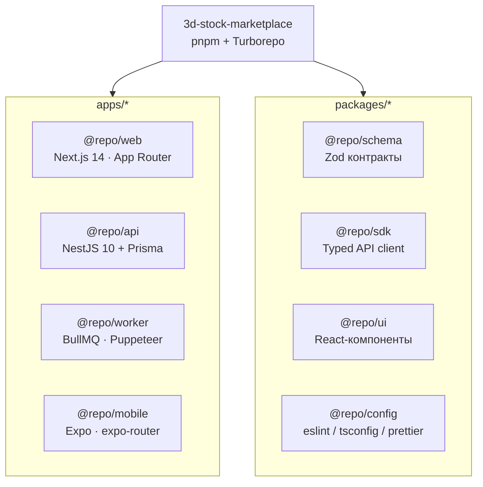
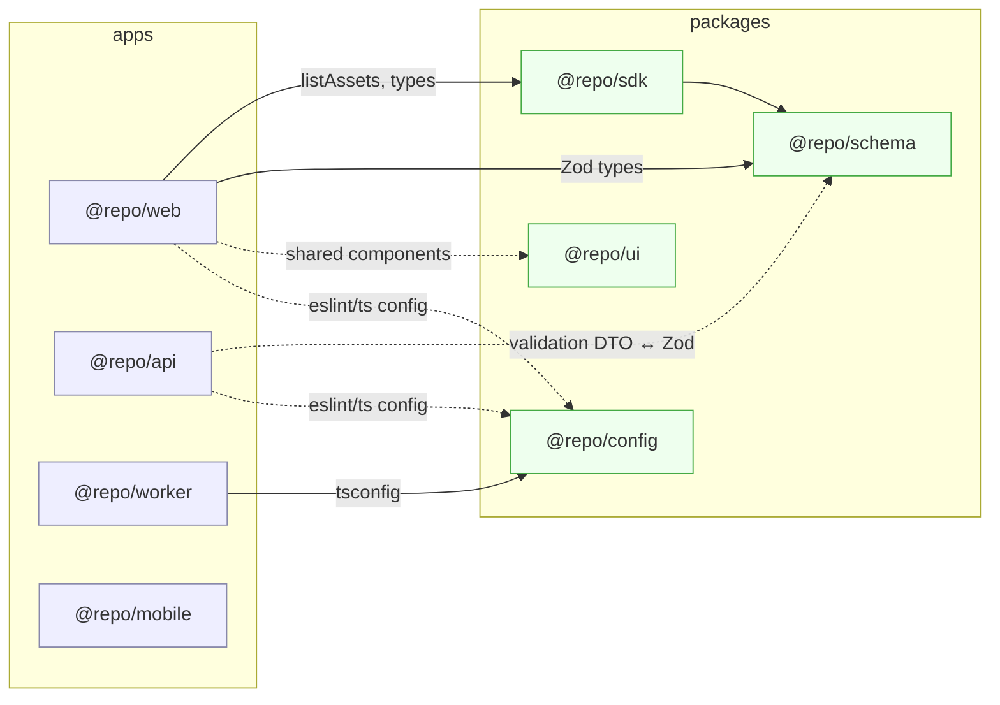
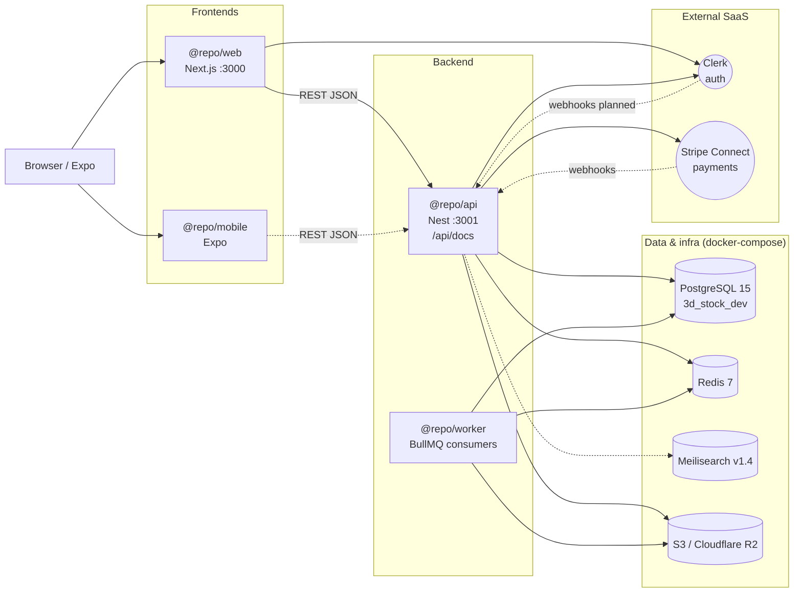
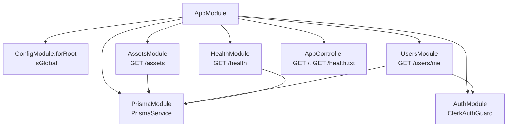
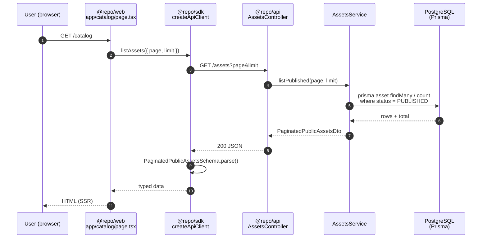
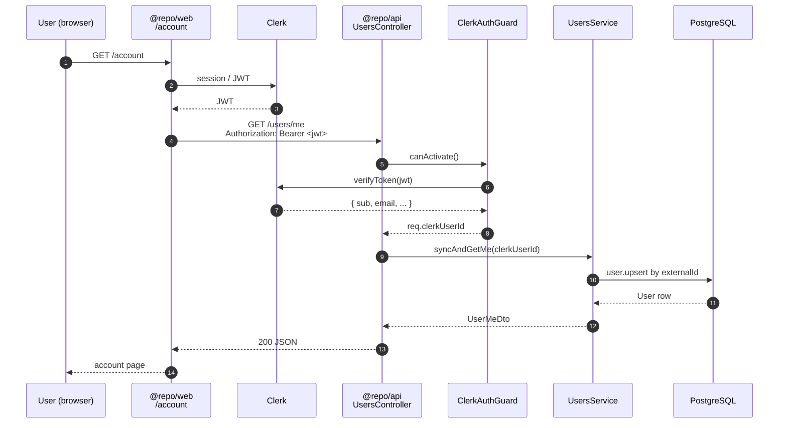
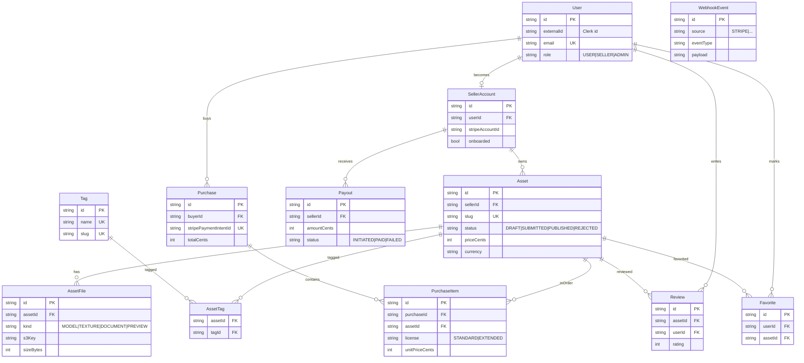
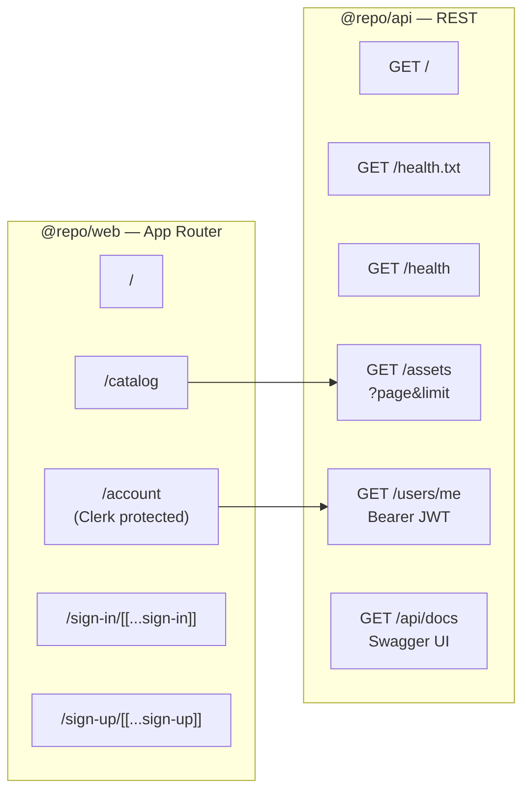

# Архитектура 3D Stock в диаграммах

Визуализация кодовой базы монорепо: из чего состоит, как связаны приложения и пакеты, как течёт трафик, какая модель данных. Диаграммы — Mermaid, рендерятся GitHub/VS Code из коробки.

> Статус реализации каждого блока — в [docs/PROJECT_STATE.md](./PROJECT_STATE.md). Этот файл описывает **структуру**, а не прогресс.

---

## 1. Монорепо верхнего уровня

Turborepo + pnpm workspace. Всё живёт под `apps/*` (разворачиваемые сервисы и клиенты) и `packages/*` (переиспользуемый код).

---

## 2. Граф зависимостей пакетов

Стрелка — «импортирует». Контракты (`@repo/schema`) — центр схемы: на них опирается и API, и SDK, и веб.

---

## 3. Инфраструктура и внешние сервисы

Картина продакшена/локалки из `docker-compose.yml` и `.env.example`: Postgres — основное хранилище, Redis — очереди/кэш, Meilisearch — поиск, S3-совместимое хранилище — бинарники ассетов. Clerk делает auth, Stripe Connect — платежи.

---

## 4. Модули API (NestJS)

`apps/api/src/app.module.ts` собирает 6 модулей. `PrismaModule` — единственная точка доступа к БД; `AuthModule` выдаёт `ClerkAuthGuard`, которым защищаются приватные эндпоинты.

---

## 5. Поток запроса: каталог

От перехода на `/catalog` в браузере до ответа из Postgres. Next.js рендерит серверно, зовёт API через SDK, ответ валидируется Zod-схемой из `@repo/schema`.

---

## 6. Поток запроса: `/users/me` (Clerk)

Приватный эндпоинт: `ClerkAuthGuard` проверяет Bearer-JWT, в БД делается upsert пользователя.

---

## 7. Модель данных (Prisma ER)

`apps/api/prisma/schema.prisma` — 10 моделей домена маркетплейса: пользователи и продавцы, ассеты с файлами и тегами, покупки, выплаты, отзывы, избранное, журнал вебхуков.

---

## 8. Маршрутизация

Видимая наружу поверхность — маршруты веба и REST API.

---

## Как обновлять диаграммы

- Любой GitHub-просмотрщик или VS Code с расширением Mermaid рендерит блоки выше.
- Если добавляешь новый модуль Nest — обнови §4; новую модель Prisma — §7; новый внешний сервис — §3.
- Прогресс по фичам по-прежнему ведётся в [docs/PROJECT_STATE.md](./PROJECT_STATE.md) (правило проекта — не плодить `*_STATUS.md` / `*_REPORT.md`).
